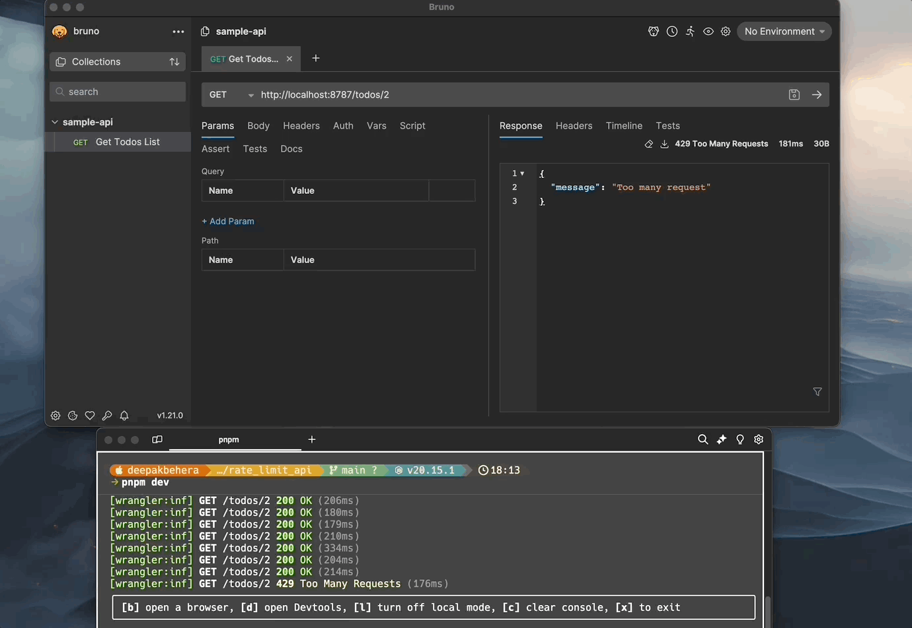
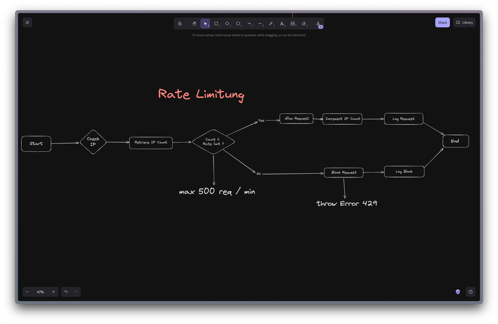

# API Rate Limiting with Redis

## Overview

This project implements API rate limiting using Redis as a backend. Rate limiting helps protect our API from abuse and ensures fair usage among clients.

## Demo

## Features

- RESTful API endpoints
- Redis-based rate limiting

## How It Works

We use a sliding window algorithm to track and limit API requests. Redis stores the request counts for each client within a specified time window.

## Configuration

Our rate limiter is configured with the following parameters:

- Window size: 10 seconds
- Request limit: 10 requests per window

## Implementation

We use the `Ratelimit` class from the `@upstash/ratelimit` package along with Redis for storing rate limit data. Here's a basic example of how it's implemented:

## Dependencies

- Express.js
- @upstash/redis
- @upstash/ratelimit
- wrangler
